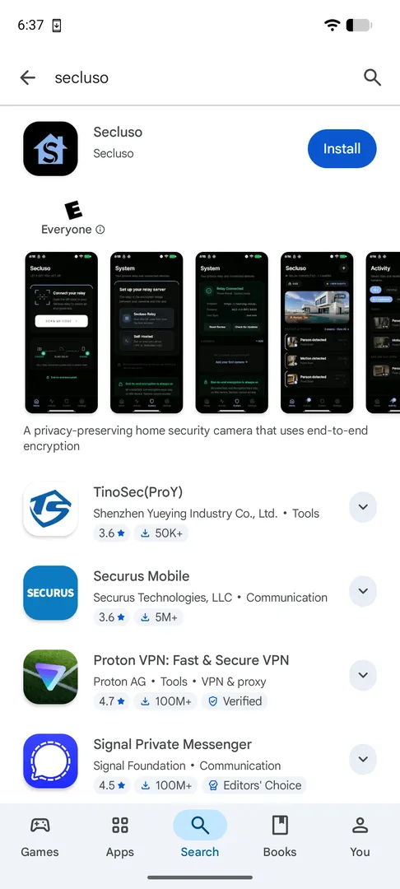
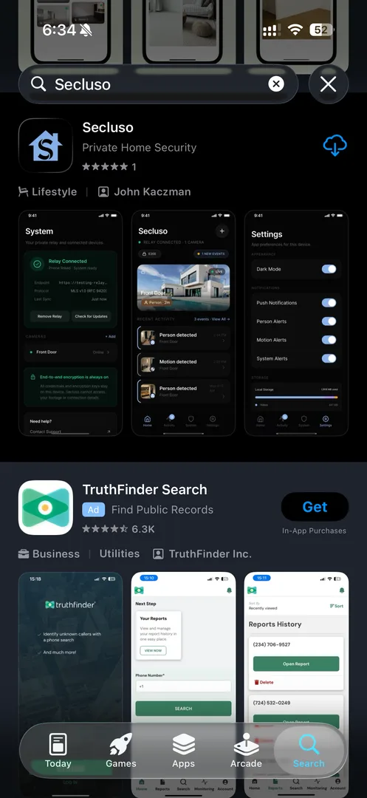

# Getting the Mobile App

Install the Secluso app from your phone's app store.

<figure markdown>
{ .shot }
<figcaption><strong>Android</strong> (Google Play)</figcaption>
</figure>

<figure markdown>
{ .shot }
<figcaption><strong>iOS</strong> (App Store)</figcaption>
</figure>

1. Open the **Google Play Store** (Android) or **App Store** (iOS).
2. Search for **Secluso**.
3. Tap **Install** / **Get**, then open the app.

!!! note "Look for the right app"
    The publisher is **Secluso** on Google Play and **John Kaczman** on the App
    Store. Make sure it matches before installing.

!!! note "Permissions you'll be asked for later"
    During setup the app requests a few permissions, each used locally:

    | Permission | Why it's needed |
    | --- | --- |
    | Nearby devices / Wi-Fi | To find and connect directly to your camera |
    | Notifications | To alert you about motion, people, and system events |

!!! tip "App installed"
    Once the app opens to the **"Let's get you set up"** screen, you're ready
    for the next step.

[Next: Adding a relay](relay.md)
