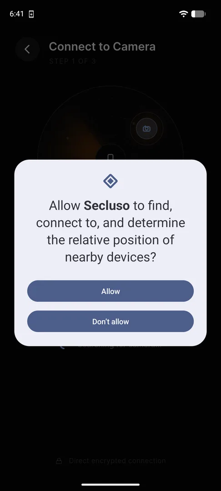
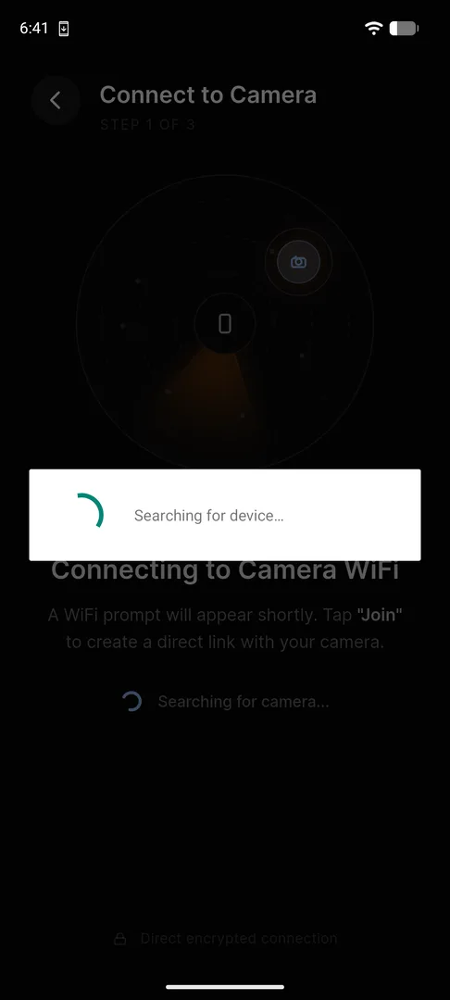
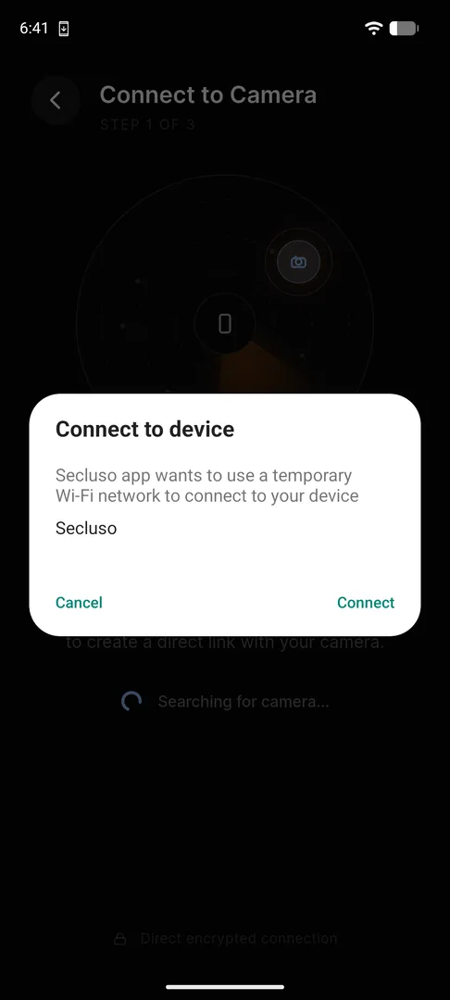
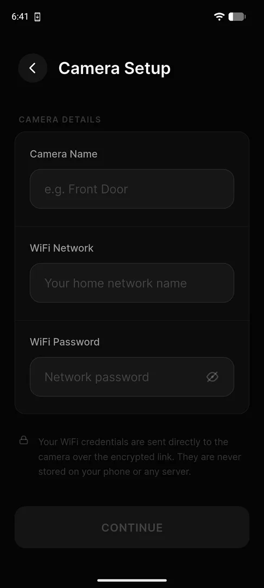
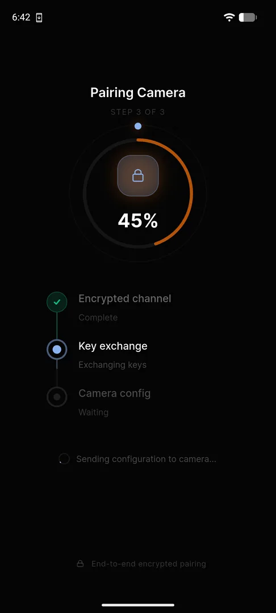
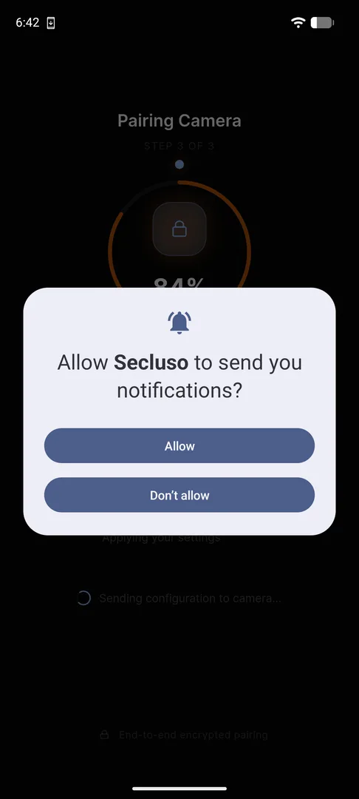
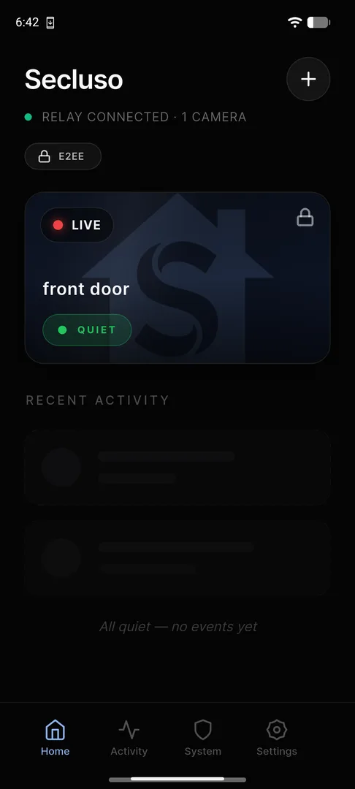
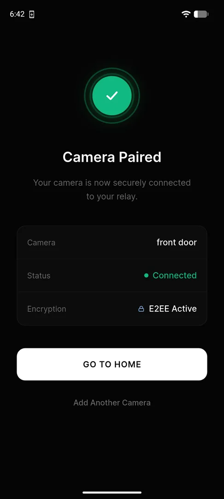
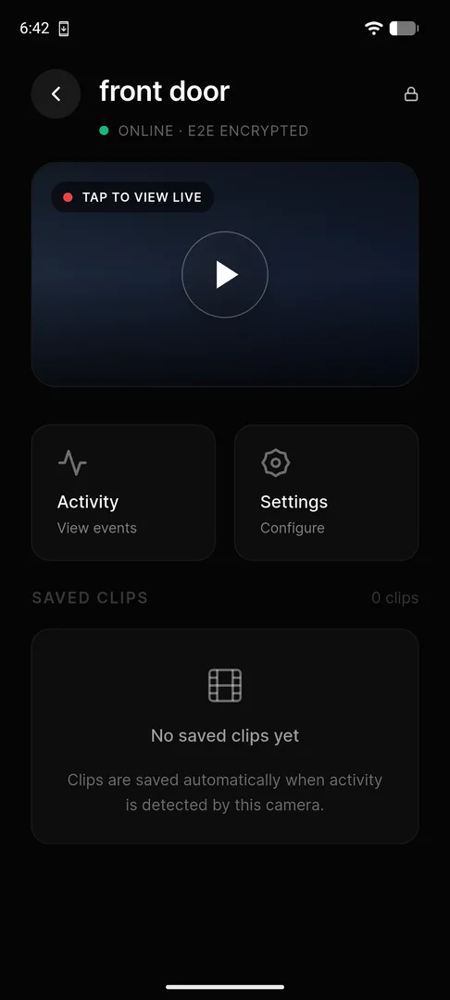
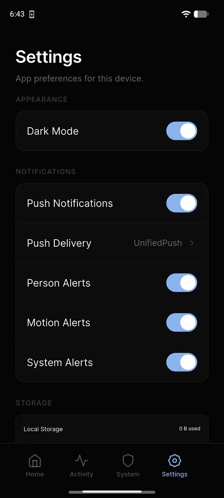

# Pairing with Your Camera

This is the final step. Your phone forms a direct, encrypted connection to the
camera, hands it your Wi-Fi details, and exchanges keys.

The app guides you through pairing in three numbered steps. From the **System**
tab or Home screen, tap **Add your first camera** to begin.

## Step 1: Connect to the camera

The app discovers your camera over a temporary, direct link. You'll see two
quick system prompts. Approve both.

<figure markdown>
{ .phone }
<figcaption>1. Tap <strong>Allow</strong> so the app can find nearby devices.</figcaption>
</figure>

<figure markdown>
{ .phone }
<figcaption>2. The app searches for your camera.</figcaption>
</figure>

<figure markdown>
{ .phone }
<figcaption>3. Tap <strong>Connect</strong> to join the camera's temporary <code>Secluso</code> Wi-Fi.</figcaption>
</figure>

!!! note "Why a temporary Wi-Fi network?"
    The camera briefly broadcasts its own `Secluso` network so your phone can
    reach it directly, before it's on your home Wi-Fi. This is how the first
    encrypted handshake happens.

## Step 2: Enter camera details

Tell the camera who it is and how to reach your home network, then tap
**Continue**.

{ .phone }

| Field | What to enter |
| --- | --- |
| **Camera Name** | A friendly label, e.g. *Front Door* |
| **Wi-Fi Network** | Your home network name (SSID) |
| **Wi-Fi Password** | Your home network password |

!!! warning "Use your everyday Wi-Fi details"
    Enter the network the camera should join **permanently**: your normal home
    Wi-Fi, not the temporary `Secluso` network from Step 1.

!!! note "Your Wi-Fi password is never stored"
    Credentials are sent directly to the camera over the encrypted link. They
    are never saved on your phone or any server.

## Step 3: Pair and exchange keys

The app sets up encryption with the camera, progressing through three stages.
Approve notifications so you can receive alerts.

<figure markdown>
{ .phone }
<figcaption>Encrypted channel, then key exchange, then camera config.</figcaption>
</figure>

<figure markdown>
{ .phone }
<figcaption>Tap <strong>Allow</strong> to get motion and person alerts.</figcaption>
</figure>

## Done: camera paired

When pairing finishes, your camera is **Connected** with **E2EE Active**. Tap
**Go to Home**, or **Add Another Camera** to repeat the process.

{ .phone }

## Using your camera

<figure markdown>
{ .phone }
<figcaption>The <strong>Home</strong> tab lists your cameras and recent activity.</figcaption>
</figure>

<figure markdown>
{ .phone }
<figcaption>Tap a camera to view live, see activity, and find saved clips.</figcaption>
</figure>

Open the **Settings** tab to choose your push delivery method and toggle
**Person**, **Motion**, and **System** alerts independently.

{ .phone }

!!! note "Not receiving alerts?"
    Make sure **Push Notifications** is on in Settings, that you tapped
    **Allow** on the notification prompt during pairing, and that a push
    delivery method is selected.
