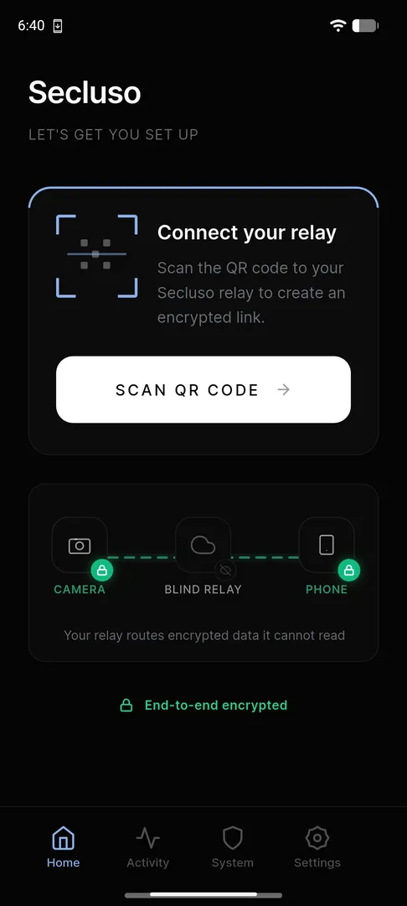
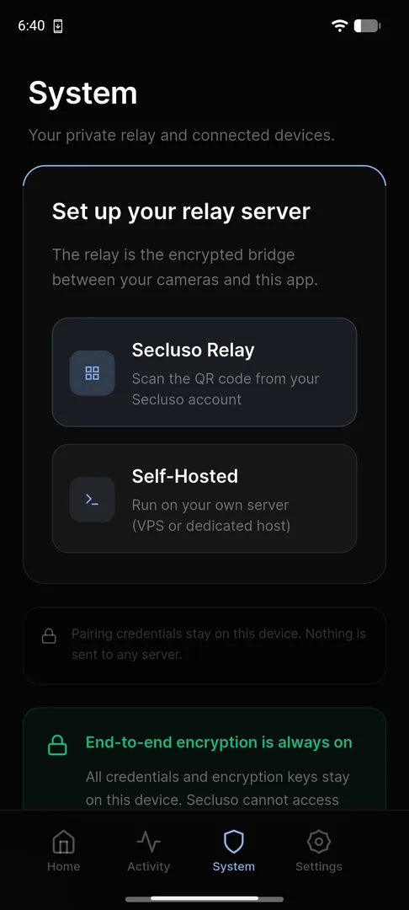
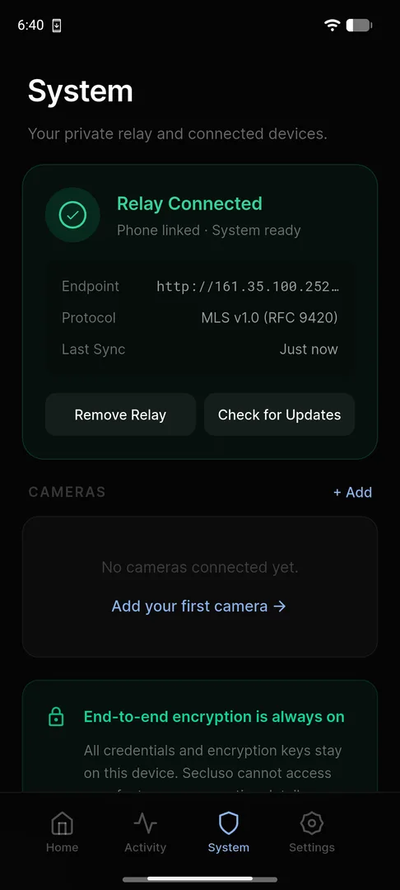

# Adding a Relay

The **relay** forwards traffic between your cameras and your phone, so you can
watch your camera from anywhere. It only ever handles encrypted blobs it cannot
read.

## Step 1: Start the connection

On the **Home** screen, tap **Scan QR code** under *Connect your relay*.

{ .phone }

## Step 2: Choose your relay

Open the **System** tab and pick how to run the relay:

- **Secluso Relay**: scan the QR code from your Secluso account.
- **Self-Hosted**: run the relay on your own VPS or dedicated host.

{ .phone }

!!! note "Credentials stay on your device"
    Whichever option you choose, your credentials and encryption keys stay on
    your phone. Secluso cannot access your cameras.

## Step 3: Confirm it's connected

After scanning, the **System** tab shows **Relay Connected**, with your phone
linked and the endpoint, protocol, and last sync time listed.

{ .phone }

!!! tip "Relay ready"
    With a green **Relay Connected** status, you can add a camera next. Use
    **Check for Updates** or **Remove Relay** from this screen at any time.

[Next: Pairing with your camera](camera.md)
